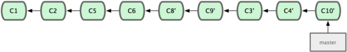

# Formation Git
## Alain Kelleter
alain@ktdev.pro - https://www.ktdev.pro

Sources du cours :

* [tuto-git/github](https://github.com/xoran/tuto-git) (le cours)
* [tuto-git-test/github](https://github.com/xoran/tuto-git-test) (dépôt fictif pour tester les commandes / tests)

---
 
### 1. Installation
Simple à réaliser quelque soit la plateforme sur laquelle on travail (GNU/Linux / Windows / MacOS)

### 2. Configuration
La configuration de Git peut s'étendre sur 3 niveaux.

Sur 3 niveaux :

* Configuration globale au système : (linux) /etc/gitconfig (`git config --system`)
* Configuration globale à l'utilisateur : (linux) ~/.gitconfig (`git config --global`)
* Configuration globale au projet : .gitconfig (`git config`)

Chaque niveau de configuration surcharge les paramètres du niveau précédent

#### 2.1 Premiers paramètres à configurer
* Nom / prénom et adresse e-mail
Ex.:

`git config --global user.name "Alain Kelleter"`

`git config --global user.email "alain@ktdev.pro"`

Vu que nous travaillons sur le niveau de l'utilisateur cela sera valable pour tous les projets sauf si l'on surcharge la configuration au niveau du projet.

* L'éditeur par défaut
Ex.:

`git config--global core.editor emacs / vim / nano / ...`

ON PEUT VERIFIER LA CONFIGURATION AVEC LA COMMANDE :

`$ git config --list`

### 3. Mise en place d'un premier dépôt

#### 3.1 Créer un dépôt Git
* Initialiser un nouveau dépôt:
 
 `$ git init`

* Récupérer un dépôt existant:

 `$ git clone`

Via protocol http/https : 
Ex.:
 
 * `$ git clone http://sources.xoransorvor.be:3000/KTDev/KT-FILMS.git`
 
Ou via le protocol ssh : 
Ex.:
 
 * `$ git clone gogs@sources.xoransorvor.be:KTDev/KT-FILMS.git`
 * `$ git clone git@github.com:xoran/KT-Shin.git`

### 4. Enregistrer des modifications dans le dépôt

* Connaître l'état des fichiers du projet

 `$ git status`

 `$ git status -s` (sommaire)

* Ajouter un fichier à l'index (staged): 

 `git add [nomdufichier]`

* Ajouter tous les nouveaux fichiers ou tous les fichiers modifiés depuis leur dernière indexation
  
 `git add .` / `git add *`
 
**REMARQUE**:  On peut gérer plus efficacement et globalement les fichiers qui ne doivent pas être suivi par git dans le projet. En créant et  configurant un fichier '.gitignore' (voir le .gitignore qui accompagne ce cours avec de plus amples exemples sur : https://github.com/github/gitignore)

### 5. Inspecter les modifications des fichiers indexés ou non

Commande : `$ git diff`

**git diff affiche les modifications ligne par ligne**

Cette commande répond aux questions:

* Quel fichier a été modifié et pas encore indexé
* Quelle modification a été indexée et est prête pour être validée  

Pour visualiser les modifications qui feront partie de la prochaine validation on utilise la commande :

`$ git diff --cached`

### 6. Valider les modifications

Commande : `$ git commit`

Une fois que l'index(staged) est dans un état qui convient au développeur, on peut valider les modifications.

Option :

* `-v` : ajoute le diff dans le commentaire
* `-m 'mon commentaire'` : ajoute directement le commentaire sans passer par l'éditeur de texte.
* `-a` : demande à Git de placer tous les fichiers déjà suivi dans la zone d'Index.

Une fois l'opération de commit terminée ce dernier possèdera un identifiant (ID) au format SHA-1 (une version raccourcie est affichée).

### 7. Supprimer ou déplacer des fichiers
#### 7.1 Suppression 

Pour supprimer des fichiers de Git, il faut les supprimer de la zone d'Index et ensuite valider (commit).

Si l'on efface le fichiers sans le faire avec Git (ex.: rm <fichier> (ligne de commande GNU/Linux). Il apparaîtra sous la section des modifications qui ne seront pas validées (c.à.d. non indéxées).

Il faut utiliser la commande suivante:

`git rm [fichier]` : avec cette commande la suppression du fichier est indexée !

#### 7.2 Déplacement

Git ne suit pas de façon explicite les mouvements de fichiers et ce même si il est capable de voir q'un fichier a été déplacé.

Pour déplacer un fichier il faut utiliser la commande suivante :

`git mv [source/fichier] [destination/fichier]` : cela revient à le supprimer de la source et à le recréer à la destination. 

### 8. Les Historiques

Pour consulter les historiques on utilise la commande:

`$ git log`

La commande `git log` possède une longue série d'options. Ces dernières permettent de paramètrer `git log` de façon à afficher avec précision sa sortie.

* `-<chiffre>` :  Affiche les n derniers commit 
* `-p` : Affiche le patch appliqué par chaque commit
* `--stat` : Affiche les statistiques de chaque fichier pour chaque commit
* `--shortstat` : N'affiche que les lignes modifiées/insérées/effacées de l'option --stat
* `--name-only` : Affiche la liste des fichiers modifiés après les informations du commit
* `--name-status` : Affiche la liste des fichiers affectés accompagnés des informations d'ajout/modification/suppression
* `--abbrev-commit` : N'affiche que les premiers caractères de la somme de contrôle SHA-1
* `--relative-date` : Affiche la date au format relatif (ex.: "2 weeks ago") au lieu du format complet
* `--graph` : Affiche en caractères ASCII le graphe de branches et fusion en vis-à-vis de l'historique
* `--pretty` : Affiche les commit dans un format alternatif. Les formats incluent oneline, short, full, fuller et format(avec lequel on peut spécifier sont propre format)
* `--oneline` : Option de convenance correspondant à : --pretty=oneline --abbrev-commit

Présentation du : `$ git log --pretty`

Le paramètre --pretty permet d'obtenir des sorties "custom".

Exemples : 
* `git log --pretty=oneline` : Affiche un commit par ligne
* `git log --pretty=format:'...'`

Options de format :
* `%H` : Somme de contrôle du commit
* `%h` : Somme de contrôle abrégée du commit 
* `%T` : Somme de contrôle de l'arborescence
* `%t` : Somme de contrôle abrégée de l'arborescence
* `%P` : Somme de contrôle des parents
* `%p` : Somme de contrôle abrégée des parents
* `%an` : Nom de l'auteur
* `%ae` : E-mail l'auteur
* `%ad` : Date de l'auteur (au format de l'option -date=)
* `%ar` : Date relative de l'auteur
* `%cn` : Nom du validateur
* `%ce` : E-mail du validateur
* `%cd` : Date du validateur
* `%cr` : Date relative du validateur
* `%s` : Sujet

Exemple de git log formaté :

`$ git log --pretty=format:'%h - %an - %ar : %s'`

`52f2e30 - Kentaro Tatsu - il y a 15 heures : Update Formation Git.md - Chapter 7(full) and 8(begin)`
`21e3ba2 - Kentaro Tatsu - il y a 3 jours : Update Formation Git.md`
`3cbf321 - Kentaro Tatsu - il y a 3 jours : Commit 5 first chapters`
`0f1eae8 - Kentaro Tatsu - il y a 3 jours : Add Formation Git file`
`95b854f - Kentaro - il y a 3 jours : Initial commit `

Souvent utilisé :

`$ git log -1 -p` : Affiche les modifications du dernier commit 

### 9. Annuler des actions

* Modifier un commit
* Désindexer déjà indexé
* Réinitialiser un fichier modifié

*** !!! Attention certaines modification sont permanentes !!! ***

#### 9.1 Modifier un commit
Il peut arriver que l'on valide(commit) une modification trop tôt en oubliant des fichiers.

Commande pour modifier un commit :

'git commit --amend`

Cette commande reprend l'index du commit précédent.
L'éditeur s'ouvre avec les modifications et le message.
Il est possible d'uniquement modifier le message du commit.

#### 9.2 Désindexer un fichier déjà indexé

Pour désindexer un fichier (avant de lancer le commit), on utilise la commande suivante:

`$ git reset HEAD [file]`

#### 9.3 Réinitialiser un fichier modifié

Pour replacer un fichier dans son état  au niveau du précédent checkout : 

`$ git checkout -- [fichier]`

Suite à cette commande, le fichier sera remis dans l'état dans lequel il était lors du dernier commit et toute modification qui aurait été réalisée entre-temps sera ***IRREMEDIABLEMENT PERDUE !***

### 10. Travailler avec des dépôts distants

Pour collaborer sur vos projets Git et pour externaliser ces derniers, nous allons travailler avec des dépôts distants.
Les dépôts distants hébergent vos projets sur internet ou le réseau de votre entreprise.
Des droits peuvent être assignés aux dépôts distants (lecture/écriture, lecture seule).

Un projet peut avoir plusieurs dépôt distants.

#### 10.1 Ajouter un dépôt distant 
Commande: 

`$ git remote add [nom] [adresse du dépôt distant]`

Ex.:
`$ git remote add origin https://github.com/xoran/tuto-git-test.git`

#### 10.2 Récupérer un dépôt distant 
Commande:

`$ git fetch [nom du depot distant]`

Ex.:
`$ git fetch origin` 

Cette commande récupère toutes les données que l'on ne possède pas encore du projet.
Dans le cas où l'on clone un dépôt distant, le dépôt distant est automatiquement ajouté sous le nom "origin".
le Si dépôt est différent que celui ajouté par défaut, les branches seront ajoutées dans "nom du dépôt distant/master"

#### 10.3 Pousser son travail sur un dépôt distant 
Commande:

`$ git push [depot distant] [nom de la branche]`

Ex.:
`$ git push origin master`

#### 10.4 Inspecter un dépôt distant 
Pour avoir plus d'informations sur un dépôt distant.

Commande:
`$ git remote show [dépot distant]`

Ex.:
`$ git remote show origin`

#### 10.4 Retirer et renommer des dépôts distants

Renommer une référence à un dépot :

Commande:
`$ git remote rename [ancienne référence] [nouvelle référence]`

Ex.:
 `$ git remote rename origin github`
 
 
Supprimer une référence à un dépot :

Commande:
`$ git remote rm [nom de la référence]`
 
Ex.:
`$ git remote rm github`

Plus d'infos sur le travail avec les dépôts distants : [ICI](https://git-scm.com/book/fr/v1/Les-bases-de-Git-Travailler-avec-des-d%C3%A9p%C3%B4ts-distants) 

### 11. Les Etiquettes (tags)

Git donne la possibilité d'étiqueter un certain état dans l'historique comme important.
Généralement on utilise les étiquettes pour marquer les différentes versions d'un projet.

#### 11.1 Lister les étiquettes

Commande:
`$ git tag`

Retourne la liste des étiquettes par ordre alphabétique.

Pour effectuer une recherche:
`$ git tag -l '[chaîne de caractère]*'`

Le caractère wildcard '*' est autorisé.

#### 11.2 Créer des étiquettes

Git utilise deux types d'étiquettes:

* a. Les étiquettes légères
* b. Les étiquette annotées

##### a. Les étiquettes légère
Une étiquette légère ressemble beaucoup à une branche qui ne change pas, c'est juste un pointeur sur un commit spécifique.
Elles se réduisent à stocker la somme de contrôle d'un commit dans un fichier, aucune autre information n'est conservée.
Pour créer une étiquette légère, on utilise `git tag` sans option :
Ex.:
`$ git tag v1.4-lw`

##### b. Les étiquettes annotées
Les étiquettes annotées, par contre sont stockées en tant qu'objets à part entière dans la base de données de Git.
Elles ont une somme de contrôle, contiennent le nom et l'adresse e-mail du créateur, la date, un message d'étiquetage et peuvent être signées et vérifiées avec GNU Privacy Guard (GPG).
Créer des étiquettes annotées est simple avec Git. Le plus simple est de spécifier l'option -a à la commande tag :
Ex.:
`$ git tag -a v1.2.m -m 'Annotation'`

***Remarque*** : On peut étiqueter les anciens commits et donc faire de l'étiquetage 'après coup'

#### 11.3 Partager les étiquettes

Par défaut, la commande git push ne transfère pas les étiquettes vers les serveurs distants. 
Il faut explicitement pousser les étiquettes après les avoir créées localement. 
Ce processus s'apparente à pousser des branches distantes — vous pouvez lancer git push origin [nom-du-tag].

`$ git push origin v1.5`

Si vous avez de nombreuses étiquettes que vous souhaitez pousser en une fois, vous pouvez aussi utiliser l'option `--tags` avec la commande git push.

#### 11.4 Extraire une étiquette

Au prélable il faut récupérer toutes les données du dépôt distant avec `git pull` ou `git fetch`
Pour se placer à la position d'un commit étiqueté on lance la commande suivante :
Ex.:
`$ git checkout -b v1.1.0`

Cette commande va créer une nouvelle branche et nous placer dedans.
Grâce à ce mécanisme nous pouvons naviguer à travers les différentes versions de notre projet.

Plus d'infos sur les étiquettes : [ICI](https://git-scm.com/book/fr/v1/Les-bases-de-Git-%C3%89tiquetage) 

### 12 Les Branches

Créer une branche signifie diverger de la ligne principale de développement et continuer à travailler sans se préoccuper de cette ligne principale.
La méthode de Git pour gérer les branches est particulièrement légère, permettant de réaliser des embranchements quasi instantanément et de basculer entre les branches généralement aussi rapidement. Git encourage à travailler avec des méthodes qui privilégient la création et la fusion de branches, jusqu'à plusieurs fois par jour.

Plus d'infos sur ce qu'est une branche : [ICI](https://git-scm.com/book/fr/v1/Les-branches-avec-Git-Ce-qu-est-une-branche)  

#### 12.1 Créer une nouvelle branche
Commande:
`$ git branch [nom de la branche]`
Ex.:
`$ git branch testing`

#### 12.2 Changer de branche
Commande:
`$ git checkout [nom de la branche]`

Ex.:
`$ git checkout testing`

Cela à pour effet de déplacer le HEAD (pointeur) sur la branche 'testing'.

Si à ce stade on modifie le projet en ajoutant un fichier (ex.: testing-file.txt), on l'ajoute à l'index et on valide la modification(commit).
Le contenu de la branche testing va à partir de maintenant différer de la branche master du projet.

Pour le vérifier, il suffir de revenir sur la branche master avec un:
`git checkout master`

Effectuez un `$ ls` pour lister le contenu du répertoire et vous ne verrez pas apparaître le fichier 'testing-file.txt', ce dernier ayant été créé sur la branche 'testing'.
Cela déplace le HEAD(pointeur) sur la branche 'master et replace le répertoire de votre projet dans l'état du snaphot pointé par la branche master.

Test:  Ajoutons un ficher sur la branche master.
`$ touch master-file1.txt`

Affichons l'état des branches du projet :
Au format texte :
`$ git log --oneline --decorate --graph --all`

Sur une interface graphique :
`gitk --all`

#### 12.3 Les branches - Fusions
Pour présenter les fusions de branches, nous allons réaliser quelques mises en situations (usecase).

##### Mises en situation

-- **1ère mise en situation**

1. On développe une application
2. On crée une nouvelle branche pour travailler sur un problème
3. On effectue des modifications et on les valide
4. On  nous demande de corriger une faille critique sur la production
5. On bascule sur la branche de production
6. On crée une nouvelle branche pour réaliser le correctif
7. Après avoir testé le correctif on fusionne la branche du correctif et on pousse sur la production
8. On rebascule sur la branche sur laquelle on travaillait au départ
9. On termine notre travail sur le problème et une fois le problème réglé on effectue une fusion

**DEBUT MISE EN SITUATION **

1. On décide de travailler sur le problème(issue en anglais), on crée une branche spécifique et on se place dedans.

    `$ git checkout -b issue01`  - *issue01* est un terme arbitrairement choisi

    Est équivalent à :
    `$ git branch issue01`
    `$ git checkout issue01`

2. On effectue des modifications nécessaires pour régler le problème et on les valide (commit) :

    `$ git commit -a -m 'Update file3.txt: ajout constante de PI et fonction KTcirc() #issue01'`

3. On reçoit une demande par tél il faut modifier l'application
     On rebascule sur la branche master :
     `$ git checkout master `
     
     On développe modification en créant une nouvelle branche :
     `$ git checkout -b hotfix`  - *hotfix* est un terme arbitrairement choisi
     
     On modifie le code et on valide :
     `$ touch file6.txt` (+ édition  du code du fichier)
     `$ git add file6.txt`
     `$ git commit -m 'Create HOTFIX on file6.txt'` 
     
4. On souhaite fusionner le HOTFIX sur la branche master
     
     On se place sur la branche master :      
     `$ git checkout master`
     
     On fusionne les deux branches :     
     `$ git merge  hotfix`
     
     Ce type de merge est le plus simple à réaliser et on l'appel le **Fast-Forward**.
     Git déplace son pointeur (HEAD) et le fait avancer sur le commit HOTFIX

     On peut dés lors supprimer la branche hotfix avec la commande suivante :
     `$ git branch -d hotfix`
     
5. On retourne sur notre branche *issue01* pour terminer notre travail :
     `$ git checkout issue01`
    
    On termine nos modifications (édition de file3.txt et enregistrement) et on valide : 
    `git commit -a -m 'issue01 - fixed'`

    On décide de fusionner issue01 sur master (fusion un peu spéciale vu qu'il y a eu différenciation entre les deux branches) :  			
    
    On se place sur master :
    `$ git checkout master`
    
    On fusionne les deux branches :
    `$ git merge issue01`
    
    Git ouvre alors votre éditeur par défaut parce qu'il va créer lui même un commit de fusion (merge) et créer un instantané qui sera le résultat de  la fusion des deux branches.
    
    Git à fait ce que l'on, appel un **Merge commit** ou en français un commit de fusion.
    
    
    -- **2ème mise en situation**
    Cas où l'on modifie un même fichier dans 2 branches différentes qui vont devoir être fusionnées. Dans ce cas, il est possible que Git n'arrive pas à faire la fusion seul.
    Git va alors générer un conflit. Nous allons devoir régler le conflit à la main... .
    Nous allons tester la **fusion à 3 sources**.
        
    **DEBUT MISE EN SITUATION**
    
    On crée une branche issue02 et on se place dedans:
    `$ git checkout -b issue02`
    
    On crée un fichier issue02.txt et on valide les modifications
    `$ touch issue02.txt` + éditer le fichier et ajouter du contenu
    `$ git add issue02.txt`
    `$ git commit -m 'Add issue02.txt' `
	
   On repasse sur la branche master et on créer un fichier du même nom avec un autre contenu:
   `$ git checkout master`
   `$ git touch issue02.txt` + éditer le fichier et ajouter du contenu différent
   `$ git add issue02.txt`
   `$ git commit -m 'Add issue02.txt onmaster branch'`
   
   Ensuite on essaie de fusionner les deux branches:
   `$ git merge issue02`
   
   Réponse de Git:
>   Fusion automatique de issue02.txt
>   CONFLIT (ajout/ajout) : Conflit de fusion dans issue02.txt
>   La fusion automatique a échoué ; réglez les conflits et validez le résultat.
   
   On édite le fichier et on garde le code souhaité, on supprime  également les balises que Git à ajouté dans le fichier:
   Supprimer les balises : 
   * <<<<<<<<<
   * HEAD
   * =========

   Une fois l'édition du fichier terminé, vérifiez le status du projet:
   `$  git status`
   
   Et comme le demande Git, effectuez une commande `add` pour marquer le conflit comme résolu:
   `$ git add issue02.txt`
   `$ git status`  -  La commande  retournera que le conflit est résolu
   `$ git commit -a -m 'Fusion master/issue02 for issue02 patch'`  - Validez les modifications
   `$ git branch -d issue02`- Suppression de la branche issue02 qui n'est plus nécessaire
   
  Le conflit est réglé et la fusion en ordre.
   
#### 12.4 Les branches - Gestion des branches 

##### Lister les branches

`$ git branch` sans argument permet de lister les branches en local:
`$ git branch - v` pour obtenir plus d'informations (mode verbeux)
`$ git branch --merged` pour obtenir la liste des branches déjà fusionnées
`$ git branch --no-merged`pour obtenir la liste des branches pas encore fusionnées
`$ git branch -a ` pour obtenir la liste des branches distantes
  
##### Supprimer une branche

`$  git branch -d [nom de la branche]`
`$  git branch -D [nom de la branche]` pour forcer la suppression (par ex. si la branche n'était pas encore fusionnée)

#### 12.5 Les branches - Travailler avec les branches 

Nous allons distinguer ici le travail avec deux type de branches:

1. Les branches dites au long cours
2. Les branches thématiques

##### Les branches au long cours

Avec la fusion à 3 sources fusionner une même branche plusieurs fois sur une longue période est très aisé et pratique.

Cela signifie que l'on peut avoir plusieurs branches ouvertes en permanence pour différentes phases dans le cycle de notre projet, pour ensuite les fusionner sans que cela pose de grandes difficultés.

De nombreux développeurs utilisent Git avec ce type d'approche. Il s'agit par exemple de n'avoir que du code stable et testé dans la branche master (qui au passage peut porter un autre nom ("prod" par ex.). 

Parallèlement à cette branche on peut avoir d'autres branches (ex. "dev", "next",...), ces branches accueillent les développements en cours qui fonc l'objet de tests de stabilité. Quand la branche de développement devient stable, on fait passer la branche de production à ce niveau.

On peut gérer différents niveaux de stabilité. Sur de gros projets on crée des branches dites "proposed". Ce sont des branches parallèles qui ne sotn pas encore intégrées aux branches "dev" et "prod", elles contiennent généralement des fonctionnalités en attente qui seront intégrée par après dans "dev" et qui après une séries de tests pourront finir dans la production. 

##### Les branches thématiques

Les branches thématiques sont utiles quelque soit la taille du projet. Elles ont une courte durée de vie. Elles sont généralement créées pour gérer une fonctinnalité ou une tâche particulière (ex. les patch, fix et autres issues) comme nous l'avons pratiqué lors de nos exercices précédent.

#### 12.6 Les branches - Introduction aux branches distantes

Les branches distantes sont des références(pointeurs) à l'état des branches sur votre dépôt distant. Ce sont des branches locales qu'on ne peut pas modifier ; elles sont modifiées automatiquement lors de communications réseau. Les branches distantes agissent comme des marques-pages pour vous aider à vous souvenir de l'état de votre dépôt distant lorsque vous vous y êtes connecté. **Les branches distantes sont des références (pointeurs) vers l'état des branches sur votre dépôt distant**.

Pour obtenir la liste complète de ces références : 
`$ git ls-remote [remote name]` (ex.:`$git ls-remote origin`)

Elles prennent la forme de (distant)/(branche). Par exemple, si vous souhaitiez visualiser l'état de votre branche master sur le dépôt distant origin lors de votre dernière communication, il vous suffit de vérifier la branche origin/master. Si vous étiez en train de travailler avec un collègue et qu'il a mis à jour la branche prob53, vous pourriez avoir votre propre branche prob53 ; mais la branche sur le serveur pointerait sur le commit de origin/prob53.

Cela peut paraître déconcertant, alors éclaircissons les choses par un exemple. Supposons que vous avez un serveur Git sur le réseau à l'adresse git.notresociete.com. Si vous clonez à partir de ce serveur, Git le nomme automatiquement origin et en tire tout l'historique, crée un pointeur sur l'état actuel de la branche master et l'appelle localement origin/master ; vous ne pouvez pas la modifier. Git vous crée votre propre branche master qui démarre au même commit que la branche master d'origine, pour que vous puissiez commencer à travailler.

Les branches locales ne sont pas automatiquement synchronisées sur les sereurs distants. Vous devez "pousser" (push) explicitement les branches que vous souhaitez partager.

##### Quelques commandes

Pour lister les branches distantes : 
`$ git branch -a`

Pour ajouter une branche distante :
`$ git remote add [nomcourt] [url]`

Ex.: `$ git remote add origin https://github.com/xoran/tuto-git.git` 

Pour pousser une branche ou plusieurs(optionnels et peu courant) :
`$ git push [distant] [branche] [branche2] [...]` (si git indique un problème de référence remplacer [branche] par HEAD:[branche])

Ex.: `$ git push origin master`

Pour récupérer une branche distante sur mon dépôt distant (branche que vous ne possédez pas encore - ajoutée par un collègue par ex.) :
`$ git fetch`
Ensuite vous pourrez créer cette branche en local et la faire pointer sur la branche distante :
 Ex.: `$ git checkout -b issue03 origin/issue03.`

** IMPORTANT ! **
** Gardez à l'esprit que lorsque vous récupérez une nouvelle branche depuis un serveur distant, vous ne créé pas automatiquement une copie locale éditable, mais seulement un pointeur sur la branche distante qui n'est pas directement modifiable. ** 

Si vous souhaitez fusionner cette branche sur votre branche de travail local :
`$ git merge [distant]/[branche]`

Ex.: `$ git merge origin/issue03`

Dans le cas contraire, si vous ne souhaitez pas fusionner la branche distante avec votre travail, vous pouvez créer une branche et copier la branche distante dedans :

Ex.: `$ git checkout -b issue03 origin/issue03`

Pour supprimer une branche distante :
`$ git push  [nom distant] [:nom branche distante]`

Ex.: `$ git push origin :issue01`

#### 12.7 Les branches - Suivre les branches distantes

L'extraction d'une branche locale à partir d'une branche distante crée automatiquement ce qu'on appelle une branche de suivi. Les branches de suivi sont des branches locales qui sont en relation directe avec une branche distante. Si vous vous trouvez sur une branche de suivi et que vous tapez `$ git push`, Git sélectionne automatiquement le serveur vers lequel pousser vos modifications. De même, `$ git pull` sur une de ces branches récupère toutes les références distantes et fusionne automatiquement la branche distante correspondante dans la branche actuelle.

Lorsque vous clonez un dépôt, il crée généralement automatiquement une branche master qui suit *origin/master*. C'est pourquoi les commandes *git push* et *git pull* fonctionnent directement sans plus de paramétrage. Vous pouvez néanmoins créer d'autres branches de suivi si vous le souhaitez, qui ne suivront pas *origin* ni la branche *master*.

Un cas d'utilisation simple est l'exemple du sous-chapitre précédent, en lançant :
`$ git checkout -b [branche] [nomdistant]/[branche]`

La commande `git push ` sans option sélectionne automatiquement le serveur vers lequel "pousser" vos modifications.
Avec options : `$git psuh origin/master`

Pour connaître la branche suivie :
`$ git branch -vv`

Pour changer la branche suivie : 
`$ git branch -u origin/[nom de la nouvelle branche]`
ou
`$ git --set-upstream-to origin/[nom de la nouvelle branche]`

#### 12.8 Tirer une branche distante
 
La commande `git fetch` récupère l'ensemble des changements présents sur le serveur, mais elle ne modifie en rien votre répertoire de travail.
Il faut faire un `git merge` pour fusionner les nouveaux changements.

La commande `git pull` fait un `git fetch`suivi d'un `git merge` tout de suite après.

#### 12.9  Suppression des branches distantes

Commandes : 
`$ git push origin --delete [nom de la branche]`
ou
`$ git push origin :[nom de la branche]`

#### 12.10 Rebaser (Rebasing)

Dans Git, il y a deux façons d'intégrer les modifications d'une branche dans une autre : en fusionnant (*merge*) et en rebasant (*rebase*). Dans ce chapitre, vous apprendrez la signification de rebaser, comment le faire, pourquoi c'est un outil plutôt ébouriffant et dans quels cas il est déconseillé de l'utiliser.

##### Les bases

Si vous revenez à un exemple précédent du chapitre sur la fusion (voir la figure 12.10-1), vous remarquerez que votre travail a divergé et que vous avez ajouté des commits sur deux branches différentes.

*Figure 12.10-1. Historique divergent initial*

Comme nous l'avons déjà expliqué, le moyen le plus simple pour intégrer ensemble ces branches est la fusion via la commande merge. Cette commande réalise une fusion à trois branches entre les deux derniers instantanés de chaque branche (C3 et C4) et l'ancêtre commun le plus récent (C2), créant un nouvel instantané (et un commit), comme montré par la figure 12.10-2.

*Figure 12.10-2. Fusion d'une branche pour intégrer les historiques divergents.*

Cependant, il existe un autre moyen : vous pouvez prendre le patch de la modification introduite en C3 et le réappliquer sur C4. Dans Git, cette action est appelée rebaser. Avec la commande rebase, vous prenez toutes les modifications qui ont été validées sur une branche et vous les rejouez sur une autre.

Dans cet exemple, vous lanceriez les commandes suivantes :

`$ git checkout experience`
`$ git rebase master`
`First, rewinding head to replay your work on top of it...`
`Applying: added staged command`

Cela fonctionne en cherchant l'ancêtre commun le plus récent des deux branches (celle sur laquelle vous vous trouvez et celle sur laquelle vous rebasez), en récupérant toutes les différences introduites entre chaque validation de la branche sur laquelle vous êtes, en les sauvant dans des fichiers temporaires, en basculant sur la branche destination et en réappliquant chaque modification dans le même ordre. La figure 12.10-3 illustre ce processus.

*Figure 12.10-3. Rebaser les modifications introduites par C3 sur C4.*

À ce moment, vous pouvez retourner sur la branche master et réaliser une fusion en avance rapide (voir figure 12.10-4).

*Figure 12.10-4. Avance rapide sur la branche master*

À présent, l'instantané pointé par C3' est exactement le même que celui pointé par C5 dans l'exemple de fusion. Il n'y a pas de différence entre les résultats des deux types d'intégration, mais rebaser rend l'historique plus clair. Si vous examinez le journal de la branche rebasée, elle est devenue linéaire : toutes les modifications apparaissent en série même si elles ont eu lieu en parallèle.

Vous aurez souvent à rebaser pour vous assurer que les patchs que vous envoyez s'appliquent correctement sur une branche distante — par exemple, sur un projet où vous souhaitez contribuer mais que vous ne maintenez pas. Dans ce cas, vous réaliseriez votre travail dans une branche puis vous rebaseriez votre travail sur origin/master quand vous êtes prêt à soumettre vos patchs au projet principal. De cette manière, le mainteneur n'a pas à réaliser de travail d'intégration — juste une avance rapide ou simplement une application propre.

Il faut noter que l'instantané pointé par le commit final, qu'il soit le dernier des commits d'une opération de rebase ou le commit final issu d'une fusion, sont en fait le même instantané — c'est juste que l'historique est différent. Rebaser rejoue les modifications d'une ligne de commits sur une autre dans l'ordre d'apparition, alors que la fusion joint et fusionne les deux têtes.

##### Rebasages plus inéressants

Vous pouvez aussi faire rejouer votre rebasage sur autre chose qu'une branche. Prenez l'historique de la figure 3-31 par exemple. Vous avez créé une branche pour un sujet spécifique (serveur) pour ajouter des fonctionnalités côté serveur à votre projet et avez réalisé un commit. Ensuite, vous avez créé une branche pour ajouter des modifications côté client (client) et avez validé plusieurs fois. Finalement, vous avez rebasculé sur la branche serveur et avez réalisé quelques commits supplémentaires.

*Figure 12.10-5. Un historique avec une branche qui sort d'une autre branche thématique.*

Supposons que vous décidez que vous souhaitez fusionner vos modifications pour le côté client dans votre ligne principale pour une publication mais vous souhaitez retenir les modifications pour la partie serveur jusqu'à ce qu'elles soient un peu plus testées. Vous pouvez récupérer les modifications pour le côté client qui ne sont pas sur le serveur (C8 et C9) et les rejouer sur la branche master en utilisant l'option *--onto* de git rebase :

`$ git rebase --onto master serveur client`

Cela signifie en essence « Extraire la branche client, déterminer les patchs depuis l'ancêtre commun des branches client et serveur puis les rejouer sur master ». C'est assez complexe, mais le résultat visible sur la figure 12.10-6 est assez impressionnant.

*Figure 12.10-6. Rebaser une branche thématique sur une autre branche.*

Maintenant, vous pouvez faire une avance rapide sur votre branche master (voir figure 12.10-7) :

`$ git checkout master`
`$ git merge client`

*Figure 12.1-7. Avance rapide sur votre branche master pour inclure les modifications de la branche client.*

Supposons que vous décidiez de tirer votre branche serveur aussi. Vous pouvez rebaser la branche serveur sur la branche master sans avoir à l'extraire avant en utilisant git rebase [branchedebase] [branchedesujet] — qui extrait la branche thématique (dans notre cas, serveur) pour vous et la rejoue sur la branche de base (master) :

`$ git rebase master serveur`

Cette commande rejoue les modifications de serveur sur le sommet de la branche master, comme indiqué dans la figure 12.10-8.

 

Ensuite, vous pouvez faire une avance rapide sur la branche de base (master) :

`$ git checkout master`
`$ git merge serveur`

Vous pouvez effacer les branches client et serveur une fois que tout le travail est intégré et que vous n'en avez plus besoin, éliminant tout l'historique de ce processus, comme visible sur la figure 12.10-9:

`$ git branch -d client`
`$ git branch -d serveur`

*Figure 12.10-9. L'historique final des commits.*

##### Les dangers de rebaser

Ah... mais les joies de rebaser ne viennent pas sans leurs contreparties, qui peuvent être résumées en une ligne :

**Ne rebasez jamais des commits qui ont déjà été poussés sur un dépôt public.**

Si vous suivez ce conseil, tout ira bien. Sinon, de nombreuses personnes vont vous haïr et vous serez méprisé par vos amis et votre famille.

Quand vous rebasez des données, vous abandonnez les commits existants et vous en créez de nouveaux qui sont similaires mais différents. Si vous poussez des commits quelque part, que d'autres les tirent et se basent dessus pour travailler, et qu'après coup, vous réécrivez ces commits à l'aide de git rebase et les poussez à nouveau, vos collaborateurs devront re-fusionner leur travail et les choses peuvent rapidement devenir très désordonnées quand vous essaierez de tirer leur travail dans votre dépôt.

[Plus d'infos ici](https://git-scm.com/book/fr/v1/Les-branches-avec-Git-Rebaser#Les-dangers-de-rebaser) 